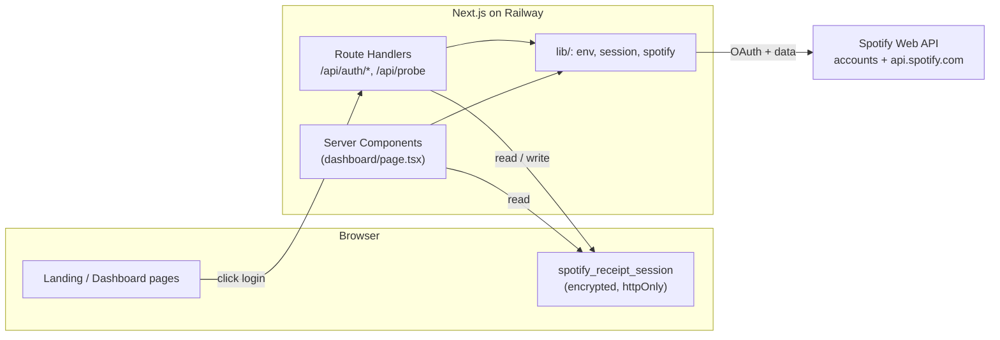
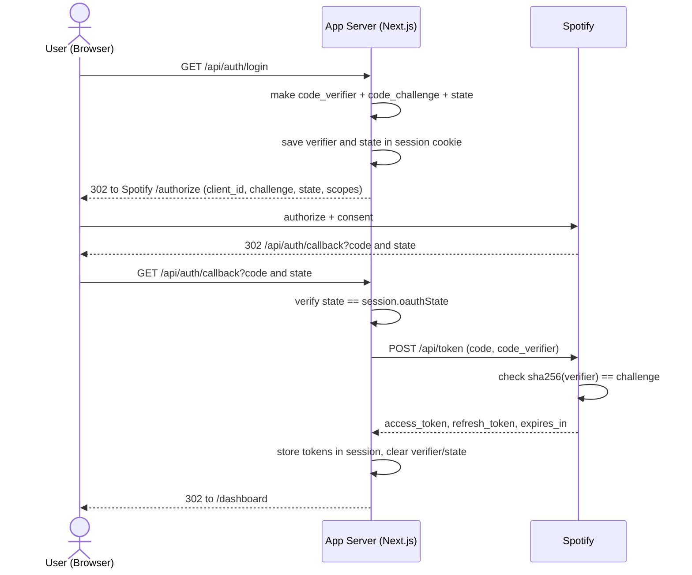
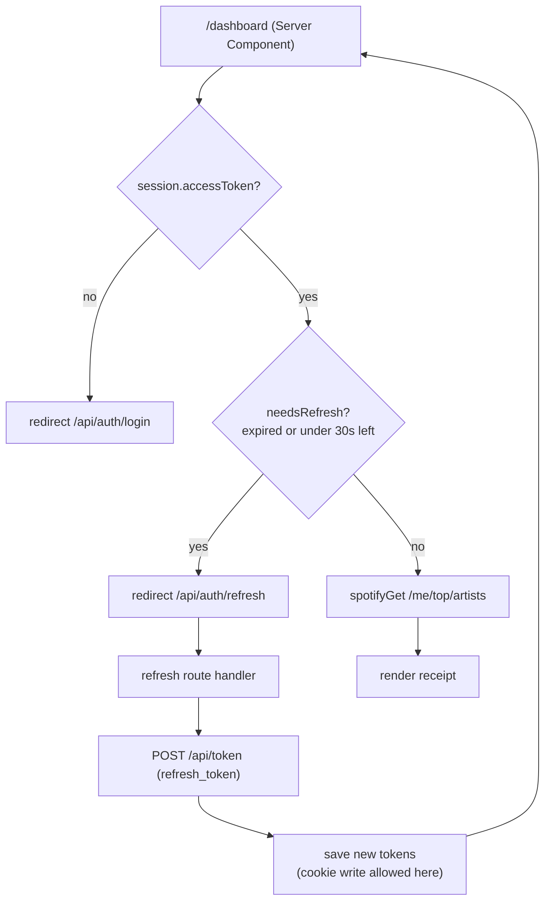
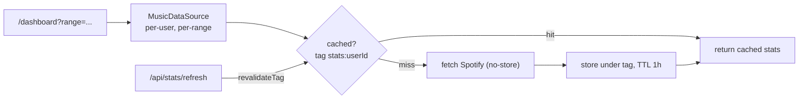
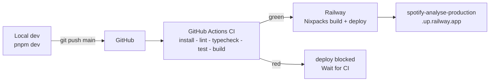

# Architecture

A retro-receipt view of your Spotify listening stats. This document describes how the app is
built, how authentication works, and how it ships — the diagrams render natively on GitHub.

> **Status:** Phase 0 (walking skeleton + live OAuth). The stats dashboard, design system,
> and shareable-image export land in later phases. See the roadmap at the end.

---

## Stack at a glance

| Concern | Choice | Why |
|---|---|---|
| Framework | **Next.js 16 (App Router) + React 19** | One deployable unit that does secure server-side token handling *and* the visual frontend. |
| Language | TypeScript | — |
| Styling | Tailwind v4 | Fast iteration toward the receipt design system. |
| Sessions | **iron-session** | Encrypted, httpOnly cookie — no datastore needed, tokens never reach client JS. |
| Package manager | **pnpm 10.25** (pinned via `packageManager`) | Fast, strict, reproducible. |
| Runtime | **Node 24** (pinned via `.nvmrc` + `engines`) | Local == CI == Railway. |
| Tests | Vitest + Testing Library | Lightweight, no Babel config. |
| CI | GitHub Actions | `install → lint → typecheck → test → build` on every push/PR. |
| Hosting | **Railway** (push-to-deploy) | Auto-deploys `main`; Nixpacks detects pnpm + Node. |

---

## System architecture

Everything Spotify-facing lives in `lib/`; the `app/` files are thin and orchestrate. The
browser only ever holds an **encrypted** session cookie — never a Spotify token.



---

## Authentication — Authorization Code + PKCE

We use the **Authorization Code flow with PKCE**, handled entirely server-side. There are two
parties that matter — *your server* and *Spotify's accounts server* — and the browser is just a
courier between them.



**The PKCE payoff:** at `/login` we generate a random `code_verifier` (kept server-side) and
send only its SHA-256 hash (`code_challenge`) to Spotify. At the token exchange we present the
verifier; Spotify re-hashes it and checks it matches the challenge. So even if the one-time
`code` in the redirect is intercepted, it's useless without the verifier — which never left the
server. This replaces the old shared-client-secret model with per-transaction proof; **we use
no client secret at all.**

Relevant code: `src/lib/spotify.ts` (`generateCodeVerifier`, `codeChallenge`,
`buildAuthorizeUrl`, `exchangeCodeForTokens`), `src/app/api/auth/login/route.ts`,
`src/app/api/auth/callback/route.ts`.

---

## Sessions & token refresh

**iron-session** is a *stateless* session library: instead of a session ID pointing at a
server-side store, the entire payload (`accessToken`, `refreshToken`, `expiresAt`, plus the
transient PKCE `codeVerifier`/`oauthState`) is serialized, **AES-encrypted**, **HMAC-signed**
with `SESSION_SECRET`, and stored in one cookie. That gives us:

- **Confidentiality** — the cookie is ciphertext; only the server can decrypt it. Combined with
  `httpOnly`, client JS (and XSS) can't read tokens.
- **Integrity** — tamper with a byte and the HMAC check fails; the session is rejected.
- **No datastore** — scales trivially. Trade-off: no instant server-side revocation before
  expiry (fine here — Spotify tokens self-expire; we can move sessions into Postgres in a later
  phase if needed). Config: `src/lib/session.ts`.

Access tokens last ~1 hour. A **Next.js constraint** shapes the refresh design: cookies can only
be written from Route Handlers / Server Actions, **never from a Server Component**. So the
dashboard (a Server Component) can't refresh-and-save itself — it bounces to a Route Handler.



`needsRefresh()` is a plain function in `src/lib/session.ts` (kept out of the component to
satisfy React Compiler's purity rule). If seamless per-request refresh is ever needed, the usual
upgrade is `middleware.ts`, which *can* set cookies on the response.

---

## Why both `state` and PKCE?

They defend **different** attacks — neither makes the other redundant, which is why OAuth 2.1
recommends both.

| | `state` | PKCE |
|---|---|---|
| Threat stopped | Login CSRF / forged callback | Stolen/intercepted authorization `code` |
| Protects | the **callback response** | the **token exchange** |
| Binds the flow to… | the **browser session** | the **client that started it** |
| Mechanism | random value stored in session, echoed back, compared | `sha256(verifier) == challenge` proof-of-possession |

- **`state`** answers: *"is this callback for the flow this browser actually started?"* Without
  it, an attacker could trick your logged-in user into completing a flow bound to the
  *attacker's* account (login CSRF).
- **PKCE** answers: *"can whoever redeems this code prove they started the flow?"* Without it, a
  leaked `code` (redirect URLs show up in history, logs, `Referer`) could be redeemed by an
  attacker.

---

## Data layer & caching (Phase 1)

All music data is read through a **`MusicDataSource`** interface (`src/lib/musicData.ts`), so the
underlying provider stays swappable. The only implementation today is Spotify
(`createSpotifyDataSource`).

Stats are cached with the **Next.js Data Cache** (`unstable_cache`) — no database needed:

- **Per-user keys** — entries are keyed by `["top-artists", userId, range]` etc., so users never
  see each other's data.
- **Token as a closure, not a key** — the access token is captured inside the cached function,
  not part of the cache key, so the hourly token refresh doesn't bust the cache. The token is
  only used on a miss.
- **TTL + tag** — top stats revalidate after 1h, recently-played after 5m; all tagged
  `stats:<userId>`.
- **Manual refresh** — `GET /api/stats/refresh` calls `revalidateTag("stats:<userId>", { expire: 0 })`
  (Next 16 requires the profile arg) to purge that user's stats on demand, then bounces back.



The dashboard (`src/app/dashboard/page.tsx`) is a Server Component that reads the range from
`?range=` (`short_term` / `medium_term` / `long_term`), fetches top artists + top tracks in
parallel, derives a genre breakdown (`topGenres`), and renders them receipt-style.

> **Shape safety:** Spotify responses have optional/missing fields (e.g. an artist may have no
> `genres`). Defaults are applied at the `MusicDataSource` mapping boundary so a missing field
> can't crash a render.

---

## Design system & components (Phase 2)

The look is a **retro-receipt**: monospace data, dashed tear lines, a rubber-stamp accent, a big
display "#1", halftone paper, and a barcode footer.

**Tokens** live in `src/app/globals.css`. A small palette is defined as CSS custom properties on
`:root` — warm paper neutrals plus one **vermilion accent** (`--accent`) — and flipped for dark
mode under `@media (prefers-color-scheme: dark)` (paper becomes dark thermal). They're exposed to
Tailwind via `@theme` (`bg-paper`, `text-paper-ink`, `text-accent`, …), so components style through
tokens and both themes come for free. Effects Tailwind can't express — the scalloped edge mask,
halftone, barcode — are the `.receipt-paper` / `.receipt-barcode` component classes.

**Layering** keeps the page thin and the card reusable:

```
MusicDataSource (raw Spotify) → buildReceiptModel (lib/receipt.ts) → ReceiptCard (components)
```

- `lib/receipt.ts` maps raw stats into a `ReceiptModel` view-model (ranks, labels, dominant-decade
  share, display name + date). Pure and unit-tested.
- `components/receipt/*` are presentational primitives (`Receipt`, `Section`, `RankRow`, `Row`,
  `Stamp`, `Barcode`) composed by `ReceiptCard`. `ReceiptCard` takes only a `ReceiptModel` — no
  fetching — so the **Phase 3 image export can render the exact same card**.
- The dashboard supplies data + chrome (`TimeRangeToggle`, refresh/logout); the card is chrome-free.

**Motion.** Switching range plays a **line-reveal** print — the paper holds still while its blocks
wipe in top-to-bottom behind an accent print-head. It's defined once in `globals.css` (reduced-motion
gated) and re-triggered by remounting the card (`key={range}`). `ReceiptStage` (client) holds the
range in state and swaps in place; all three ranges are **prefetched on the server**, so switching is
instant. The toggle is still real `?range=` links — it works without JS and stays deep-linkable
(synced via `history.replaceState`) — and is progressively enhanced to animate.

> Only real, API-derivable values appear on the receipt — Spotify exposes no per-artist play counts
> or listening minutes, so those are omitted rather than faked.

---

## Shareable image (Phase 3)

The receipt exports to a **720×1280 PNG** (9:16, story-friendly) via **`next/og`** (Satori),
server-rendered at `GET /api/receipt-image?range=` (auth-gated). The dashboard's "download" action
saves it.

Satori supports only a CSS subset — no Tailwind, no `mask`, no repeating gradients — so the image
can't reuse the DOM `ReceiptCard`. Instead: **one model, two renderers.** `ReceiptImage` mirrors the
layout with inline styles and a monospace face (**Geist Mono**, bundled in `src/og-fonts/` and read
at request time — no network). Effects are re-created Satori-safe (barcode = discrete divs; scallops
dropped). Both renderers share the `ReceiptModel` and the palette (`receiptTheme.ts`); the data-load
is shared via `dashboardData.ts`.

**Public share + unfurl.** Unfurling needs a *public* image URL, but stats live behind auth — so
sharing mints a **signed, stateless token**: the receipt model is base64url-encoded and HMAC-signed
(with `SESSION_SECRET`) into the URL (`shareToken.ts`). A public `/s?t=` page carries OG/Twitter meta
whose image is a public `GET /api/share-image?t=` PNG, so crawlers unfurl it with **no session and no
datastore**. The signature means only the server can mint a token, so visitors can't render arbitrary
content under our domain. Tokens are compact (~600 chars, well within URL limits). The dashboard
**share** action copies the `/s?t=` link.

---

## Playlist library (Phase 4)

`/playlists` shows a **Library receipt** — a collection-level analysis of your playlists: total
playlists, total tracks, owned vs followed (with % meters), collaborative count, average size, and
your biggest playlists (Row-A hover links that open in Spotify). It extends `MusicDataSource` with
`getPlaylists()` and reuses the receipt component library + `Meter`. `buildPlaylistLibrary` (pure,
tested) derives everything from `/me/playlists` metadata alone.

> **Why collection-level, not per-playlist:** we discovered empirically that
> `GET /playlists/{id}/tracks` returns **403** for this app — for **owned and followed** playlists
> alike (a restriction tightened beyond what the Phase 0 probe covered). So per-playlist track
> composition (genres/decades/standouts) is impossible for a new app; the library overview is the
> honest feature that the surviving `/me/playlists` metadata supports.

---

## Deploy pipeline (push-to-deploy)

No Railway CLI in the loop — `git push main` is the deploy trigger, gated by CI.



Railway's **Wait for CI** setting holds the deploy until the GitHub Actions check passes, so a
red build never ships. CI config: `.github/workflows/ci.yml`.

---

## File map

```
src/
  lib/
    env.ts          # lazy env access (client id, redirect uri, session secret, base url)
    session.ts      # iron-session config; getSession(); needsRefresh(); userId/displayName
    spotify.ts      # PKCE helpers, token exchange/refresh, API fetch, SCOPES
    musicData.ts    # MusicDataSource (top stats, recently-played, playlists; cached) + rollups
    receipt.ts      # buildReceiptModel view-model + topDecadeShare (pure, tested)
    playlist.ts     # buildPlaylistLibrary view-model (collection stats; pure, tested)
    dashboardData.ts# shared data-load: receipt models + playlists/analysis
    receiptTheme.ts # palette constants for the Satori image (inline styles)
    og.tsx          # renderReceiptImage(model) -> next/og ImageResponse (bundled fonts)
    shareToken.ts   # sign/verify stateless share tokens (HMAC) for public unfurl
  og-fonts/         # Geist Mono woff (400/700), read at request time for the PNG
  components/
    ReceiptStage.tsx       # client: range state + in-place line-reveal on toggle
    TimeRangeToggle.tsx    # client: progressive-enhanced range links
    receipt/               # receipt renderers + primitives
      Receipt · Stamp · Section · RankRow · Row · Barcode · Meter · index.ts
      ReceiptCard.tsx      # personal stats receipt (DOM)
      ReceiptImage.tsx     # Satori-only renderer for the shareable PNG
      LibraryReceipt.tsx   # playlist-library receipt (DOM) — reuses primitives + Meter
  app/
    layout.tsx      # metadata (OG/Twitter default -> /api/og), theme-color, fonts
    page.tsx        # landing — receipt with "Log in with Spotify"
    loading.tsx · error.tsx · not-found.tsx   # branded receipt states
    dashboard/page.tsx     # prefetches all 3 ranges; renders <ReceiptStage>
    playlists/page.tsx     # playlist Library receipt
    demo/page.tsx · demo/playlists/page.tsx  # PUBLIC demo (sample data, no login)
    s/page.tsx      # PUBLIC share page — renders a token's receipt + OG/Twitter meta
    api/
      og/route.tsx          # PUBLIC static 1200x630 brand card for link unfurls
      auth/login/route.ts     # start the OAuth handshake
      auth/callback/route.ts  # verify state, exchange code, store tokens + identity
      auth/refresh/route.ts   # renew an expired access token
      auth/logout/route.ts    # destroy the session
      stats/refresh/route.ts  # purge the user's cached stats (revalidateTag)
      receipt-image/route.tsx # auth-gated PNG of the receipt (next/og), ?range=
      share-image/route.tsx   # PUBLIC signed PNG for unfurl, ?t=<token>
      probe/route.ts          # record which endpoints return 200 vs 403
.env.example        # required env vars (PKCE — no client secret)
```

---

## Spotify API reality (verified 2026)

New apps are heavily restricted, and the plan is built around what actually works:

- **Permanently 403 for new apps:** audio-features, audio-analysis, recommendations,
  related-artists, editorial/featured playlists (Nov 2024), **and playlist tracks
  (`/playlists/{id}/tracks`) — owned and followed alike** (found in Phase 4, Jul 2026).
- **Development mode:** max **5 allowlisted users**, and the **app owner must have Spotify
  Premium** (Feb 2026). No public signups — so a public **`/demo`** route renders the real UI
  with sample data (`lib/sampleData.ts`, `DemoBanner`) for anyone who isn't allowlisted.
- **Extended quota** (which would lift these) is org-only and unreachable for a portfolio app.

`/api/probe` empirically records the live status of each endpoint for *this* app. Results for a
client ID created **2026-07-08**:

| Endpoint | Status | Use |
|---|---|---|
| `GET /me` (profile) | ✅ 200 | user identity |
| `GET /me/top/artists` (3 time ranges) | ✅ 200 | top artists |
| `GET /me/top/tracks` (3 time ranges) | ✅ 200 | top tracks |
| `GET /me/player/recently-played` | ✅ 200 | recently played |
| `GET /me/tracks` (saved) | ✅ 200 | library insights |
| `GET /me/playlists` | ✅ 200 | playlist library metadata |
| `GET /playlists/{id}/tracks` | ❌ 403 | dead — no per-playlist track access |
| `GET /audio-features/{id}` | ❌ 403 | dead — mood/energy unavailable |
| `GET /recommendations` | ❌ 404 | dead — recommendations unavailable |

Every endpoint the plan needs (Option A, stats-only) returns 200; the two dead ones confirm the
excluded features. All external data sits behind a `MusicDataSource` interface (introduced in
Phase 1) so the source is swappable.

---

## Roadmap

- **Phase 0 ✅** — walking skeleton, live OAuth (PKCE), endpoint probe.
- **Phase 1 ✅** — core stats dashboard: top tracks/artists (3 ranges), genre breakdown,
  recently-played, decade mix, per-user caching.
- **Phase 2 ✅** — retro-receipt design system: tokens, receipt component library, `ReceiptCard`,
  and an animated in-place range toggle (line-reveal print).
- **Phase 3 ✅** — shareable receipt image: 720×1280 PNG via next/og, download, and a public
  signed share link that unfurls (`/s?t=`).
- **Phase 4 ✅** — playlist **library** overview (per-playlist track access is 403): collection
  stats — owned/followed meters, biggest playlists, totals — with Row-A micro-interactions.
